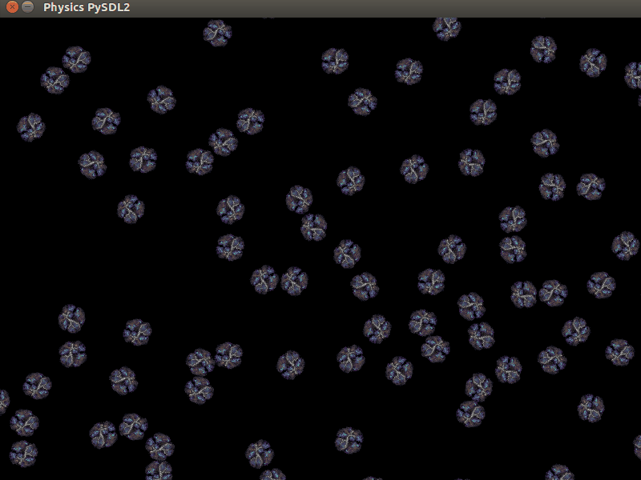

PySDL2 Physics Example
-----------------------

This is a simple physics example using pymunk and PySDL2. Asteroids are
randomly generated with random velocities.




Dependencies
-------------

**Ubuntu**

Run the following commands on Ubuntu to install the needed dependencies:

```sudo apt-get install python-pip libsdl2-2.0-0 libsdl2-gfx-1.0-0```

```sudo pip install PySDL2```

```sudo pip install pymunk```
